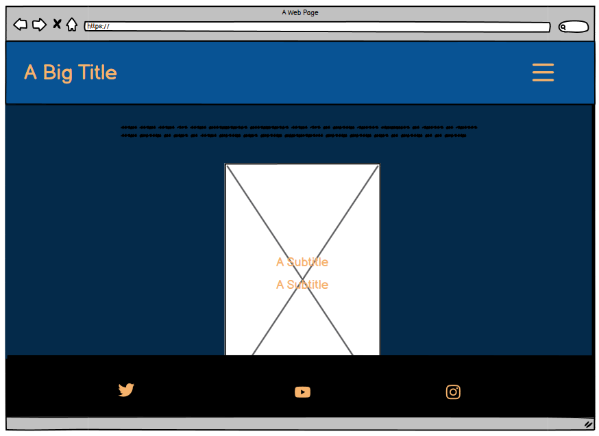
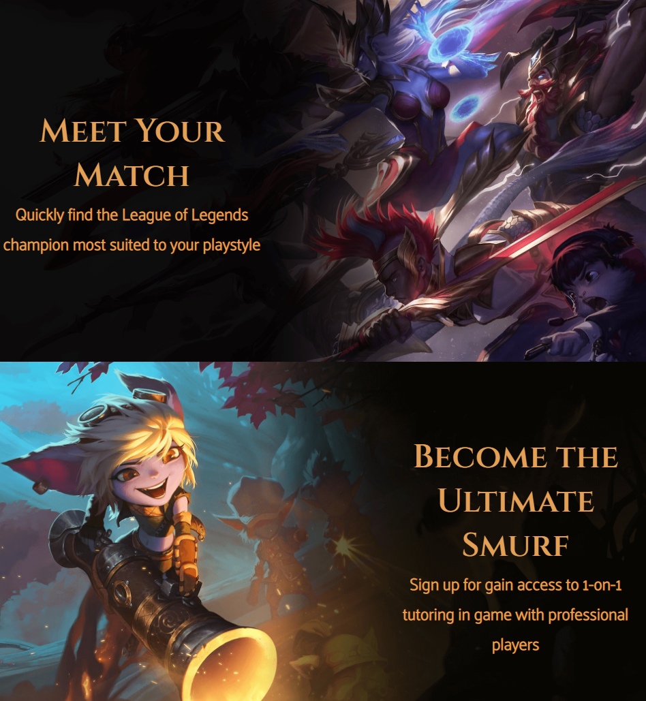

# CHAMPION SELECT

The website targets players of the multiplayer online battle arena video game, League of Legends. The service that Champion Select provides aims to reduce the massive learning curve that new players encounter when trying to choose from 163 playable champions, which can make the game feel too difficult to enjoy when you have little experience. It also targets existing players that want to learn a new role within the game, which can feel like you are starting from scratch. Users can immediately get insight into the services offered if they sign up by viewing a condensed version of the Champion Select matching section where the user is able to select who they want to play based off of their desired playstyle.

## UX

For the design of Champion Select, I wanted it to look dark and sleek, reflecting some elements of the League of Legends interface. I chose to go with clean and sharp edges for the title font and sections within the website. The faded black gradient was carried through every page of Champion Select for a choesive look.

### Colour Scheme

The colours were selected to contrast well against eachother for accessibility and readability. They are also similar to colours used in the game itself, which was done to give users a sense of familiarity with Champion Select.

- `#e4a155` used for primary text.
- `#003c57` used for primary highlights.
- `#10c5e3` used for secondary text.
- `#000000` used for secondary highlights.

### Typography

- [Cinzel](https://fonts.google.com/specimen/Cinzel) was used for the primary headers and titles.

- [Palanquin](https://fonts.google.com/specimen/Palanquin) was used for all other secondary text.

- [Flaticon](https://www.flaticon.com/) icons were used throughout the site, such as the social media icons in the footer.

## Wireframes

To follow best practice, wireframes were developed for mobile, tablet, and desktop sizes.
I've used [Balsamiq](https://balsamiq.com/wireframes) to design my site wireframes.

### Home Page Wireframes

| Size | Screenshot |
| --- | --- |
| Mobile |  |
| Tablet |  |
| Desktop |  |

### Champions Page Wireframes

| Size | Screenshot |
| --- | --- |
| Mobile |  |
| Tablet |  |
| Desktop |  |

### Signup Page Wireframes

| Size | Screenshot |
| --- | --- |
| Mobile |  |
| Tablet |  |
| Desktop |  |

## Features

### Existing Features

- **Navigation Bar**

    - This feature increases accessability and improves the sites appearance. The title will bring the user back to the home page when clicked, which adds value for the user as it will speed up navigation across the site. To remove clutter and add value to the site, the rest of the navigation buttons are conveniently accessed when the chevron menu button is pressed. Icons have been included to show relevance to the user and reflect the purpose of the site with the trophy for home, helmet for champions, and scroll for the signup page.

- **Home Page**

    - This is the first thing the user sees when they land on the site. It is valuable to the user as it communicates quickly that the aim of Champion Select is to help them pick a champion that they will play well with, and that they can sign up to the service to up their game and learn from experienced players. This is valuable to the site because it effectively communicates that there is a service being offered. The images used are of champions from the game, which will give the users an immediate connection to League of Legends.

- **Flipcards**

    - The flipcards enable the user to interact with this element of the page and make a choice between four cards. This gives them insight into what the services offered will be like once they sign up. The flipcards also allow the site to maintain its sleek clutter-free appearance. Once the user moves the cursor over the card, it will flip over giving a 3D perspective of the card as it rotates. This fun feature aims to make the user feel like they are playing a game, and display important information on the champion that is revealed. Image one is the front of the card, and image two is the back.

- **Signup Page**

    - This page allows the user to sign up to the service offered by Champion Select. After putting in their name, email and game username, they can select which roles they are most interested in learning about once they sign up. This will give Champion Select an insight into what information will be most accessed by their users. The text fields are required, which will prevent incorect information being sent.

- **Confirmation**

    - Once the user has clicked submit on the signup page, a confirmation message will appear and redirect them to the home page once ten seconds has elapsed. This is valuable because it communicates to the user that their form has been successfully submitted. The file that contains this feature is [here](confirmation.html)

- **Footer**

    - This section contains icons that link to relevant social media pages for Champion Select. These open in new tabs which is valuable to the user as well as being valuable to the site, as the user will still have the site open on a tab and will be more likely to come back once they have visited the social media account. The links to social media encourage the user to stay connected to Champion Select and join the community of other users.

### Future Features

- Abilities Breakdown
    - A new page that provides in-depth information on each champion, their abilities, casting range, buffs, and tips for using them to their highest potential.
- Tutorials
    - Include video tutorials including examples of one-on-one training sessions with pro players.
- Community Forum
    - Provide an area for users to ask and answer questions within the community.

## Tools & Technologies Used

- [HTML](https://en.wikipedia.org/wiki/HTML) used for the main site content.
- [CSS](https://en.wikipedia.org/wiki/CSS) used for the main site design and layout.
- [CSS Flexbox](https://www.w3schools.com/css/css3_flexbox.asp) used for an enhanced responsive layout.
- [Git](https://git-scm.com) used for version control. (`git add`, `git commit`, `git push`)
- [GitHub](https://github.com) used for secure online code storage.
- [GitHub Pages](https://pages.github.com) used for hosting the deployed front-end site.
- [Gitpod](https://gitpod.io) used as a cloud-based IDE for development.

## Testing

For all testing, please refer to the [TESTING.md](TESTING.md) file.

## Deployment

The site was deployed to GitHub Pages. The steps to deploy are as follows:
- In the [GitHub repository](https://github.com/Nic-Wallace/champion_select), navigate to the Settings tab 
- From the source section drop-down menu, select the **Main** Branch, then click "Save".
- The page will be automatically refreshed with a detailed ribbon display to indicate the successful deployment.

The live link can be found [here](https://nic-wallace.github.io/champion_select).

### Local Deployment

This project can be cloned or forked in order to make a local copy on your own system.

#### Cloning

You can clone the repository by following these steps:

1. Go to the [GitHub repository](https://github.com/Nic-Wallace/champion_select) 
2. Locate the Code button above the list of files and click it 
3. Select if you prefer to clone using HTTPS, SSH, or GitHub CLI and click the copy button to copy the URL to your clipboard
4. Open Git Bash or Terminal
5. Change the current working directory to the one where you want the cloned directory
6. In your IDE Terminal, type the following command to clone my repository:
	- `git clone https://github.com/Nic-Wallace/champion_select.git`
7. Press Enter to create your local clone.

Alternatively, if using Gitpod, you can click below to create your own workspace using this repository.

Please note that in order to directly open the project in Gitpod, you need to have the browser extension installed.
A tutorial on how to do that can be found [here](https://www.gitpod.io/docs/configure/user-settings/browser-extension).

#### Forking

By forking the GitHub Repository, we make a copy of the original repository on our GitHub account to view and/or make changes without affecting the original owner's repository.
You can fork this repository by using the following steps:

1. Log in to GitHub and locate the [GitHub Repository](https://github.com/Nic-Wallace/champion_select)
2. At the top of the Repository (not top of page) just above the "Settings" Button on the menu, locate the "Fork" Button.
3. Once clicked, you should now have a copy of the original repository in your own GitHub account!

## Credits

### Content

| Source | Location | Notes |
| --- | --- | --- |
| [Chris Beams](https://chris.beams.io/posts/git-commit) | version control | "How to Write a Git Commit Message" |
| [W3Schools](https://www.w3schools.com/howto/howto_js_topnav_responsive.asp) | entire site | responsive HTML/CSS/JS navbar |
| [Flexbox Froggy](https://flexboxfroggy.com/) | entire site | modern responsive layouts |
| [W3Schools](https://www.w3schools.com/howto/howto_css_flip_card.asp) | champions page | "How to create a flip card with CSS" |
| [Youtube](https://www.youtube.com/watch?v=8QKOaTYvYUA) | navigation bar | creating a collapsible nav bar |
| [Perkins](https://www.perkins.org/resource/how-write-alt-text-and-image-descriptions-visually-impaired/) | site images | "how to write alt text" |

### Media

| Source | Location | Type | Notes |
| --- | --- | --- | --- |
| [LeagueOfLegends](https://ddragon.leagueoflegends.com/cdn/img/champion/splash/Alistar_0.jpg) | champions page | image | Alistar flip card |
| [Peakpx](https://w0.peakpx.com/wallpaper/133/862/HD-wallpaper-video-game-legends-of-runeterra-tristana-league-of-legends.jpg) | home page | image | ultimate smurf background |
| [OneEsports](https://cdn.oneesports.gg/cdn-data/2022/03/LeagueofLegends_ArcanaAhriSkinSplashArt-1024x576.webp) | champions page | image | front of flip cards |
| [PinImg](https://i.pinimg.com/originals/d2/fd/91/d2fd91b78201c856ffa72a883acd6ffe.png) | champions page | image | repeating background image |
| [Wikia](https://static.wikia.nocookie.net/arcane/images/7/7a/Piltover_Season_1_Episode_4_001.png/revision/latest?cb=20211206231717) | signup page | image | Signup page background |
| [WallpaperAccess](https://wallpaperaccess.com/full/1559842.jpg) | home page | image | meet your match background |
| [BlogOfLegends](https://blogoflegends.com/files/2017/06/Amumu_8.jpg) | home page | image | image for footer |
| [WallpaperCave](https://wallpapercave.com/wp/wp5510314.jpg) | champions page | image | Lux flip card |
| [WallpaperAccess](https://wallpaperaccess.com/full/1930095.jpg) | champions page | image | Soraka flip card |
| [AlphaCoders](https://mfiles.alphacoders.com/701/thumb-701043.png) | champions page | image | Blitzcrank flip card |
| [Photopea](https://www.photopea.com/) | entire site | image | tool for image editing |
| [TinyPNG](https://tinypng.com) | entire site | image | tool for image compression |
| [FlatIcon](https://www.flaticon.com/free-icon/rank_1805899?related_id=1805877&origin=search) | nav bar | image | chevron menu icon |
| [FlatIcon](https://www.flaticon.com/free-icon/script_9160409) | nav bar | image | signup page icon |
| [FlatIcon](https://www.flaticon.com/free-icon/trophy_420105) | nav bar | image | home page icon |
| [FlatIcon](https://www.flaticon.com/free-icon/helmet_2286333) | nav bar | image | champions page icon |
| [FontAwesome](https://fontawesome.com/icons/instagram?f=brands&s=solid) | footer | icon | instagram icon |
| [FontAwesome](https://fontawesome.com/icons/youtube?f=brands&s=solid) | footer | icon | youtube icon |
| [FontAwesome](https://fontawesome.com/icons/twitter?f=brands&s=solid) | footer | icon | twitter icon |

### Acknowledgements

- I would like to thank my Code Institute mentor, [Tim Nelson](https://github.com/traveltimn) for their support throughout the development of this project.
- I would like to thank my partner Aaron, for supporting me making this transition into software development and providing many cups of coffee.
- I would like to thank the [Code Institute Slack community](https://code-institute-room.slack.com) for the moral support during bouts of imposter syndrome.
