# Testing

Return back to the [README.md](README.md) file.

## Code Validation

### HTML

I have used the recommended [HTML W3C Validator](https://validator.w3.org) to validate all of my HTML files.

| Page | W3C URL | Screenshot | Notes |
| --- | --- | --- | --- |
| Home | [W3C](https://validator.w3.org/nu/?doc=https%3A%2F%2Fnic-wallace.github.io%2Fchampion_select%2Findex.html) | 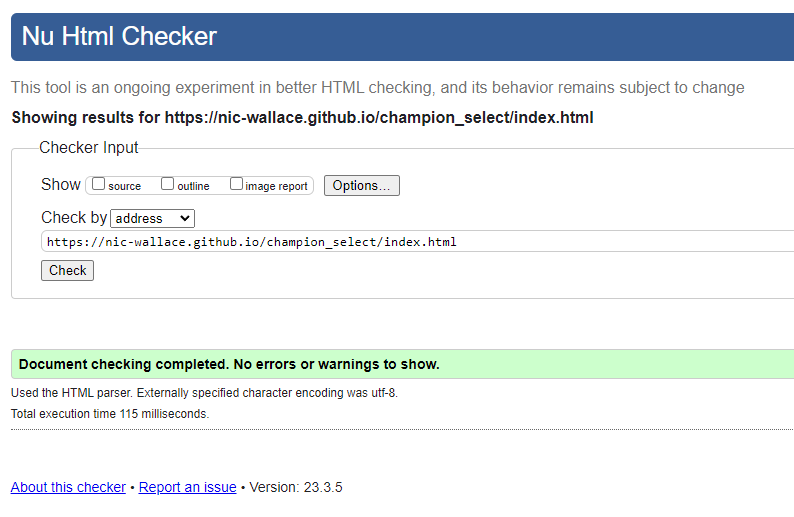 | Pass: No Errors |
| Champions | [W3C](https://validator.w3.org/nu/?doc=https%3A%2F%2Fnic-wallace.github.io%2Fchampion_select%2Fchampions.html) | 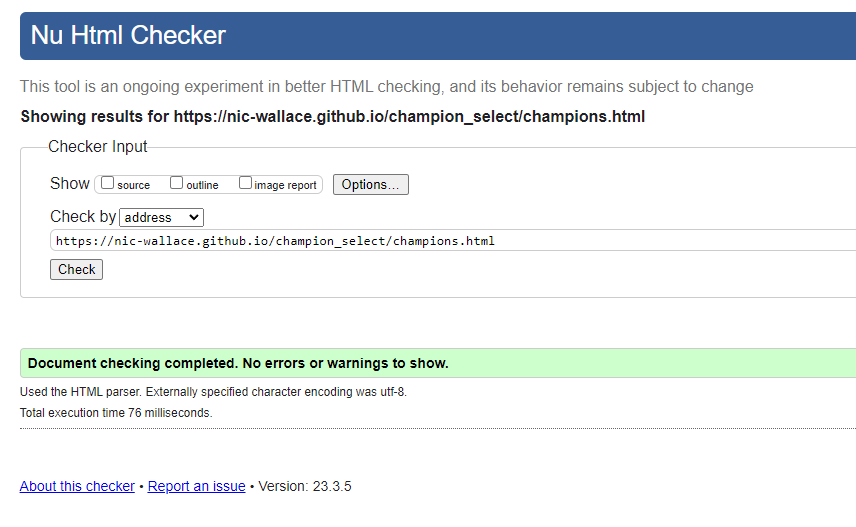 | Pass: No Errors |
| Signup | [W3C](https://validator.w3.org/nu/?doc=https%3A%2F%2Fnic-wallace.github.io%2Fchampion_select%2Fsignup.html) | 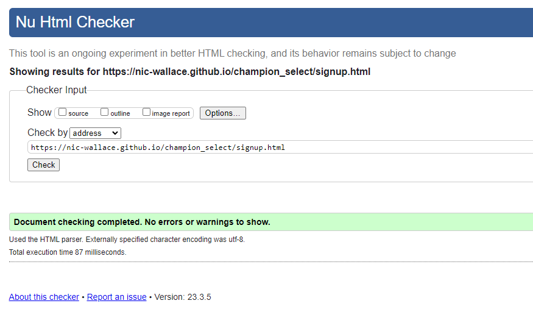 | Pass: No Errors |
| Confirmation | [W3C](https://validator.w3.org/nu/?doc=https%3A%2F%2Fnic-wallace.github.io%2Fchampion_select%2Fconfirmation.html%3Ffirst_name%3Dnic%26last_name%3Dwallace%26email%3Dnicwallace%2540champselect.com%26username%3Dchamp%26role5%3Dsupport) | 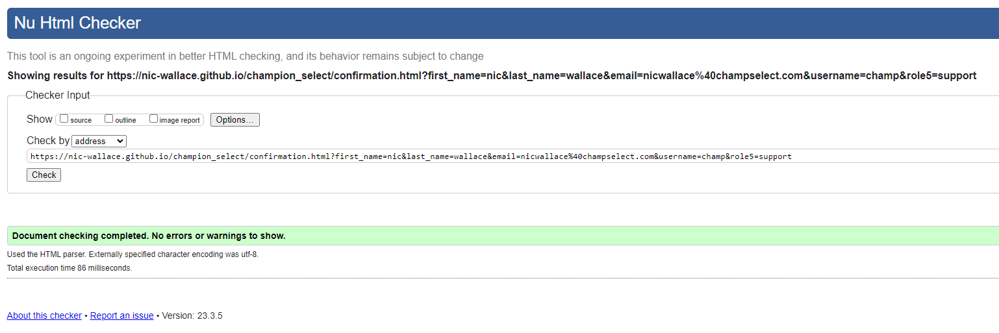 | Pass: No Errors |

### CSS

I have used the recommended [CSS Jigsaw Validator](https://jigsaw.w3.org/css-validator) to validate all of my CSS files.

| File | Jigsaw URL | Screenshot | Notes |
| --- | --- | --- | --- |
| style.css | [Jigsaw](https://jigsaw.w3.org/css-validator/validator?uri=https%3A%2F%2Fnic-wallace.github.io%2Fchampion_select%2Findex.html&profile=css3svg&usermedium=all&warning=1&vextwarning=&lang=en#warnings) | 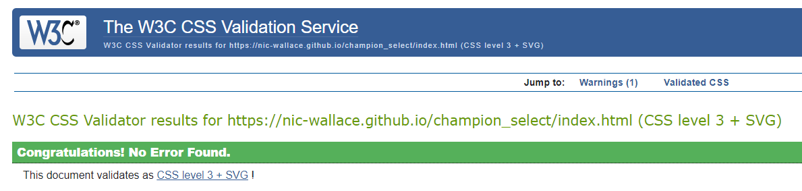 | Pass: No Errors |

## Browser Compatibility

I've tested my deployed project on multiple browsers to check for compatibility issues.

| Browser | Screenshot | Notes |
| --- | --- | --- |
| Chrome | 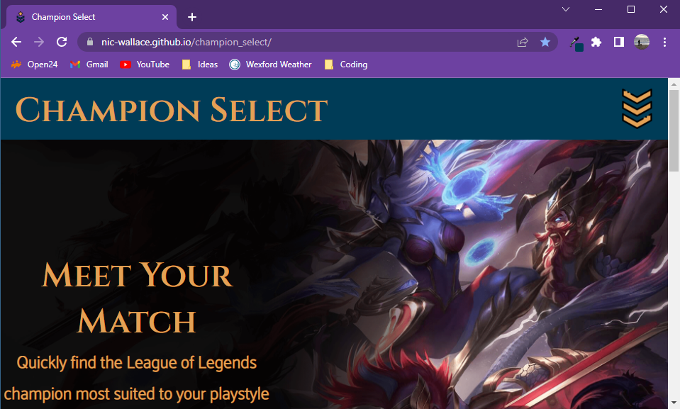 | Works as expected |
| Firefox | 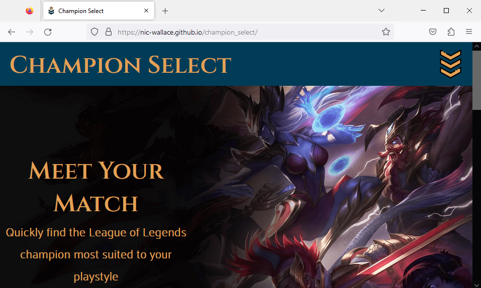 | Works as expected |
| Microsoft Edge | 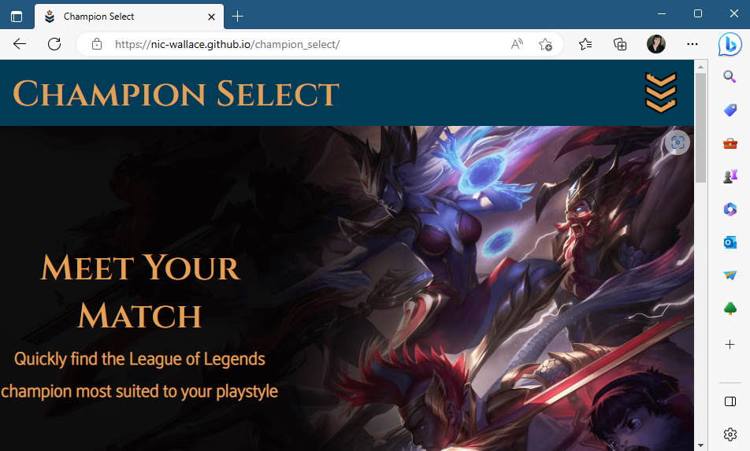 | Works as expected |
| Opera GX | 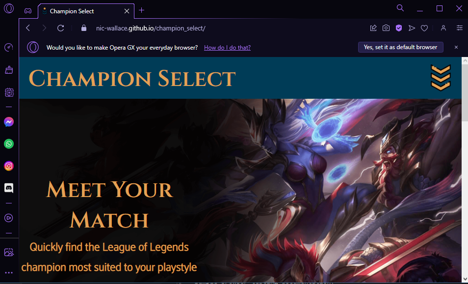 | Works as expected |

## Responsiveness

I've tested my deployed project on multiple devices to check for responsiveness issues.

| Device | Screenshot | Notes |
| --- | --- | --- |
| Mobile (DevTools) |  | Works as expected |
| Tablet (DevTools) |  | Works as expected |
| Laptop | 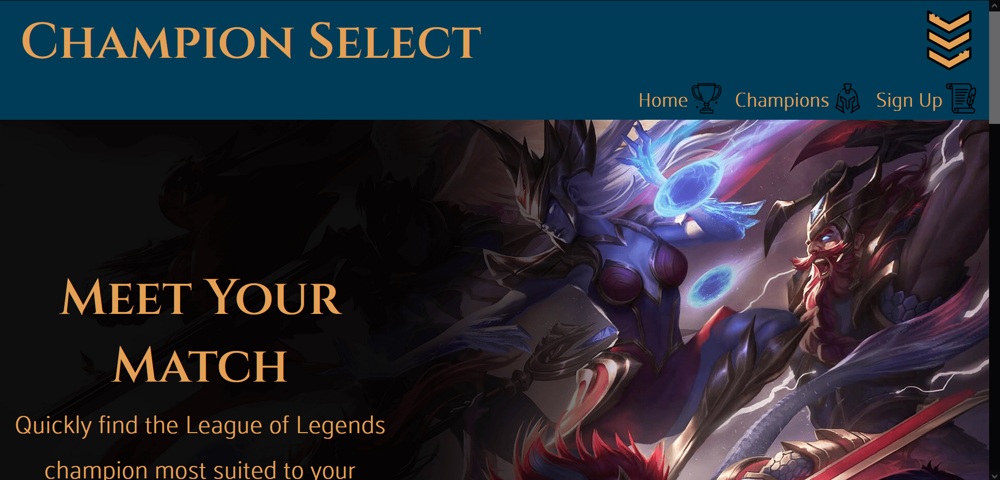 | Works as expected |
| 27" Monitor |  | Works as expected |
| Xiaomi Redmi Note 10 Pro | 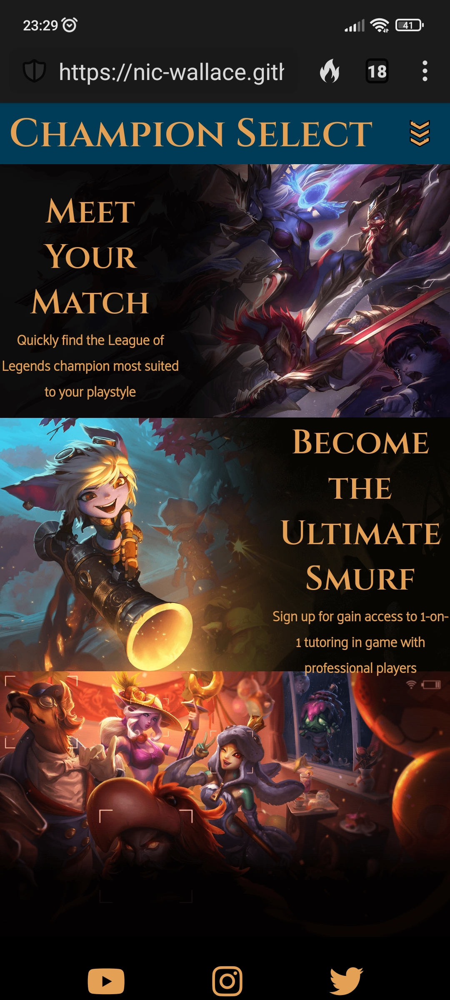 | Some scaling issues |

## Lighthouse Audit

I've tested my deployed project using the Lighthouse Audit tool to check for any issues.

| Page | Size | Screenshot | Notes |
| --- | --- | --- | --- |
| Home | Mobile | 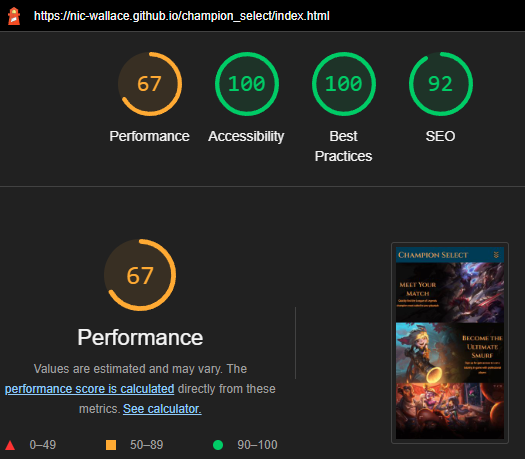 | Some minor warnings |
| Home | Desktop | 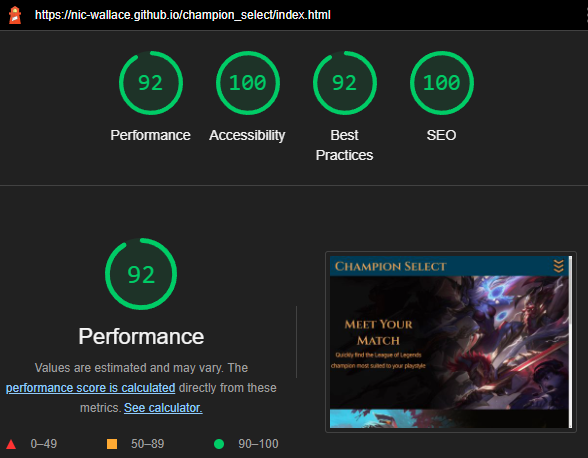 | Few warnings |
| Champions | Mobile | 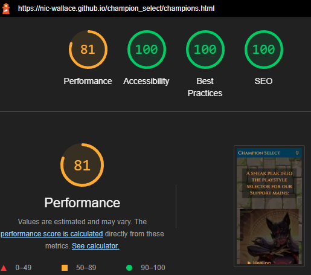 | Some minor warnings |
| Champions | Desktop | 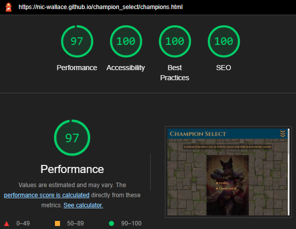 | Few warnings |
| Signup | Mobile | 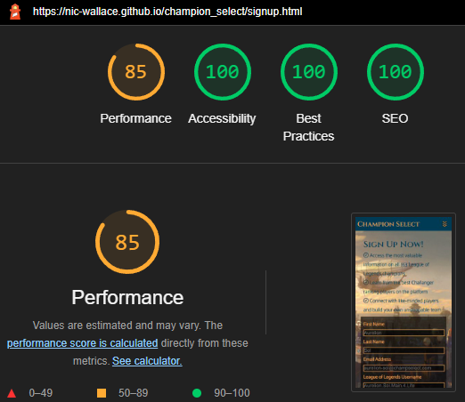 | Some minor warnings |
| Signup | Desktop | 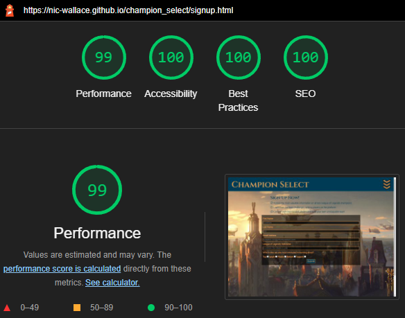 | Few warnings |

## Bugs

- Footer on main page had a height of 0px, and was half way up the page.

    - To fix this, I changed the footer position to relative, removed a container that was around the page, gave socials a position of absolute and gave them flexbox. Later on after tidying the rest of the page, I was able to remove the positioning of these elements without the bug returning.

- Flipcards on the champions page create `overflow-x` scrolling below 470px.

    - To fix this, I gave the `.flipcard` a property of `max-width: 90vw` which scales down the width of the card when the screen width is below 500px.

## Unfixed Bugs

- On devices with a width smaller than 470px, the page starts to have `overflow-x` scrolling because of the flip-card back image size.
   
   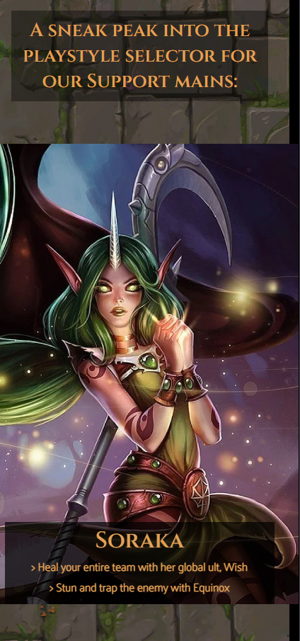

    - Attempted fix: I tried to add `max-width: 90vw` to the image, but it created a gap between the top of the image and the top of the card which I could not get rid of with extra styling changes.

Return back to the [README.md](README.md) file.