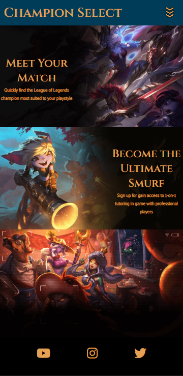

# Testing

Return back to the [README.md](README.md) file.

## Code Validation

### HTML

I have used the recommended [HTML W3C Validator](https://validator.w3.org) to validate all of my HTML files.

| Page | W3C URL | Screenshot | Notes |
| --- | --- | --- | --- |
| Home | [W3C](https://validator.w3.org/nu/?doc=https%3A%2F%2Fnic-wallace.github.io%2Fchampion_select%2Findex.html) |  | Pass: No Errors |
| Champions | [W3C](https://validator.w3.org/nu/?doc=https%3A%2F%2Fnic-wallace.github.io%2Fchampion_select%2Fchampions.html) |  | Pass: No Errors |
| Signup | [W3C](https://validator.w3.org/nu/?doc=https%3A%2F%2Fnic-wallace.github.io%2Fchampion_select%2Fsignup.html) |  | Pass: No Errors |
| Confirmation | [W3C](https://validator.w3.org/nu/?doc=https%3A%2F%2Fnic-wallace.github.io%2Fchampion_select%2Fconfirmation.html%3Ffirst_name%3Dnic%26last_name%3Dwallace%26email%3Dnicwallace%2540champselect.com%26username%3Dchamp%26role5%3Dsupport) |  | Pass: No Errors |

### CSS

I have used the recommended [CSS Jigsaw Validator](https://jigsaw.w3.org/css-validator) to validate all of my CSS files.

| File | Jigsaw URL | Screenshot | Notes |
| --- | --- | --- | --- |
| style.css | [Jigsaw](https://jigsaw.w3.org/css-validator/validator?uri=https%3A%2F%2Fnic-wallace.github.io%2Fchampion_select%2Findex.html&profile=css3svg&usermedium=all&warning=1&vextwarning=&lang=en#warnings) |  | Pass: No Errors |

## Browser Compatibility

⚠️⚠️⚠️⚠️⚠️ START OF NOTES (to be deleted) ⚠️⚠️⚠️⚠️⚠️

Use this space to discuss testing the live/deployed site on various browsers.

Consider testing at least 3 different browsers, if available on your system.

Recommended browsers to consider:
- [Chrome](https://www.google.com/chrome)
- [Firefox (Developer Edition)](https://www.mozilla.org/firefox/developer)
- [Edge](https://www.microsoft.com/edge)
- [Safari](https://support.apple.com/downloads/safari)
- [Brave](https://brave.com/download)
- [Opera](https://www.opera.com/download)

**IMPORTANT**: You must provide screenshots of the tested browsers, to "prove" that you've actually tested them.

Please note, there are services out there that can test multiple browser compatibilities at the same time.
Some of these are paid services, but some are free.
If you use these, you must provide a link to the source used for attribution, and multiple screenshots of the results.

Sample browser testing documentation:

🛑🛑🛑🛑🛑 END OF NOTES (to be deleted) 🛑🛑🛑🛑🛑

I've tested my deployed project on multiple browsers to check for compatibility issues.

| Browser | Screenshot | Notes |
| --- | --- | --- |
| Chrome |  | Works as expected |
| Firefox |  | Works as expected |
| Edge |  | Works as expected |
| Safari |  | Minor CSS differences |
| Brave |  | Works as expected |
| Opera |  | Minor differences |
| Internet Explorer |  | Does not work as expected |
| x | x | repeat for any other tested browsers |

## Responsiveness

I've tested my deployed project on multiple devices to check for responsiveness issues.

| Device | Screenshot | Notes |
| --- | --- | --- |
| Mobile (DevTools) |  | Works as expected |
| Tablet (DevTools) |  | Works as expected |
| XL Monitor |  | Works as expected |
| Xiaomi Redmi Note 10 Pro |  | Works as expected |

## Lighthouse Audit

I've tested my deployed project using the Lighthouse Audit tool to check for any issues.

| Page | Size | Screenshot | Notes |
| --- | --- | --- | --- |
| Home | Mobile |  | Some minor warnings |
| Home | Desktop |  | Few warnings |
| Champions | Mobile |  | Some minor warnings |
| Champions | Desktop |  | Few warnings |
| Signup | Mobile |  | Some minor warnings |
| Signup | Desktop |  | Few warnings |

## Bugs

⚠️⚠️⚠️⚠️⚠️ START OF NOTES (to be deleted) ⚠️⚠️⚠️⚠️⚠️

It's very important to document any bugs you've discovered while developing the project.
Make sure to include any necessary steps you've implemented to fix the bug(s) as well.

For JavaScript and Python applications, it's best to screenshot the errors to include them as well.

**PRO TIP**: screenshots of bugs are extremely helpful, and go a long way!

🛑🛑🛑🛑🛑 END OF NOTES (to be deleted) 🛑🛑🛑🛑🛑

- JS Uncaught ReferenceError: `foobar` is undefined/not defined

    

    - To fix this, I _____________________.

- JS `'let'` or `'const'` or `'template literal syntax'` or `'arrow function syntax (=>)'` is available in ES6 (use `'esversion: 11'`) or Mozilla JS extensions (use moz).

    

    - To fix this, I _____________________.

- Python `'ModuleNotFoundError'` when trying to import module from imported package

    

    - To fix this, I _____________________.

- Django `TemplateDoesNotExist` at /appname/path appname/template_name.html

    

    - To fix this, I _____________________.

- Python `E501 line too long` (93 > 79 characters)

    

    - To fix this, I _____________________.

## Unfixed Bugs

- On devices smaller than 500px, the page starts to have `overflow-x` scrolling because of the flip-card back image size.

    

    - Attempted fix: I tried to add additional styling to the image to fix this, but it started having an effect on the text layered over the image.
